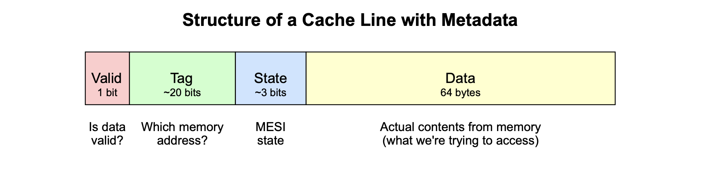
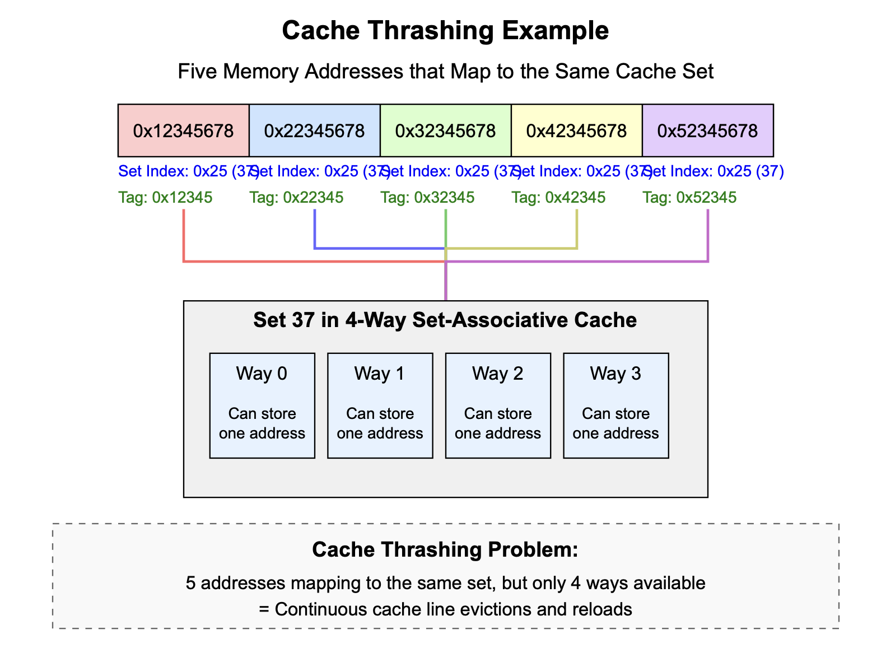
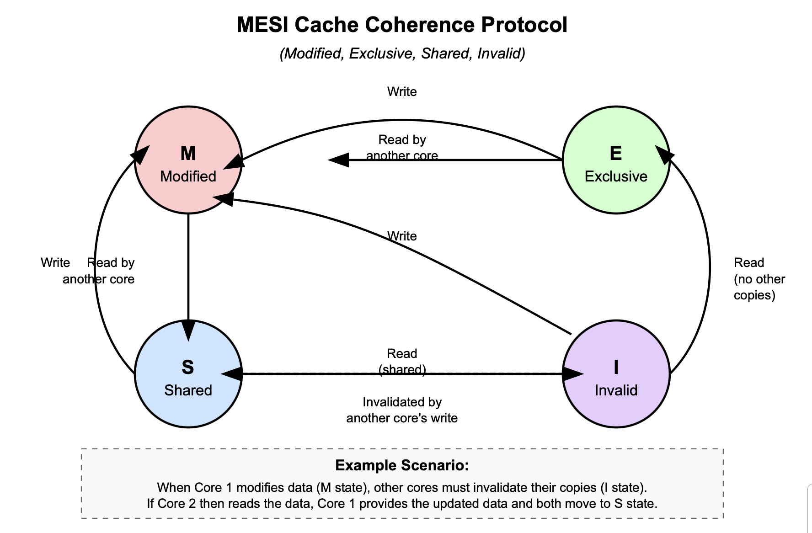
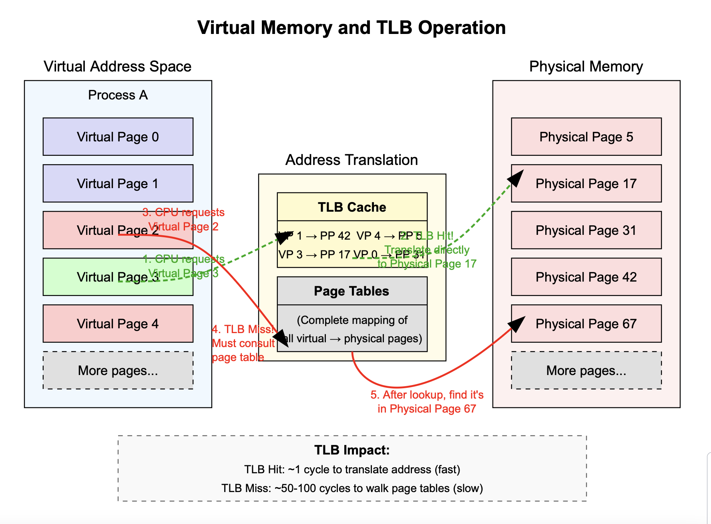

# Chapter 2: Modern Computer Architecture Overview

## 2.1 CPU Core Architecture and Execution Model

"I don't understand," said the new developer on my team, staring at his profiling results. "I optimized my algorithm from O(n²) to O(n log n), but it's only 30% faster, not the 100x improvement I expected."

This conversation took place at a financial trading firm where I was leading the performance engineering team. The developer had rewritten a critical component of our order matching engine that processed thousands of market updates per second. His algorithm was mathematically superior, but he had overlooked how modern CPUs actually execute code.

After analyzing his implementation, we discovered that the new algorithm, while performing fewer operations in total, created unpredictable memory access patterns and branch conditions that caused frequent CPU pipeline stalls and cache misses. A few hardware-aware adjustments later, performance improved by 400% while maintaining the same algorithmic complexity.

This experience illustrates why understanding CPU architecture matters for Java developers. The abstractions provided by high-level languages and virtual machines can create the illusion that algorithmic efficiency is all that matters. But underneath these abstractions lies physical hardware with complex behaviors that can dramatically impact performance.

### From Transistors to Execution Units

At their most fundamental level, CPUs are composed of billions of transistors—tiny semiconducting devices that act as electronic switches. These transistors are combined to form logic gates, which in turn create more complex structures like registers, arithmetic logic units (ALUs), floating-point units (FPUs), and control units.

When you look at a modern processor die, you'll see that a significant portion is devoted to these execution units:

1. **Arithmetic Logic Units (ALUs)** handle integer operations like addition, subtraction, and boolean logic operations. When your Java code increments a counter or compares two values with conditional logic, an ALU performs the actual computation.

2. **Floating-Point Units (FPUs)** specialize in operations involving floating-point numbers (float and double in Java). Modern FPUs often include specialized circuits for transcendental functions like sine, cosine, and square root.

3. **Registers** are extremely fast, small storage locations within the CPU. Unlike RAM, which might take 100+ nanoseconds to access, registers are accessible in a fraction of a nanosecond. The CPU uses registers to hold data that is currently being processed. While Java doesn't give you direct control over register allocation, understanding how the JIT compiler utilizes registers can explain many performance phenomena.

4. **Control Units** coordinate the activities of all other units, decoding instructions and directing data flow. Think of the control unit as the "conductor" of the CPU "orchestra."

5. **Vector Processing Units** perform the same operation on multiple data elements simultaneously, enabling Single Instruction, Multiple Data (SIMD) operations. These become increasingly important with modern Java features like the Vector API.

To see what kinds of execution resources your system has, you can use the `lscpu` command on Linux systems:

```
$ lscpu
Architecture:          x86_64
CPU op-mode(s):        32-bit, 64-bit
Byte Order:            Little Endian
CPU(s):                16
On-line CPU(s) list:   0-15
Thread(s) per core:    2
Core(s) per socket:    8
Socket(s):             1
NUMA node(s):          1
Vendor ID:             GenuineIntel
CPU family:            6
Model:                 85
Model name:            Intel(R) Core(TM) i9-9900K CPU @ 3.60GHz
Stepping:              13
CPU MHz:               4600.000
BogoMIPS:              7200.00
Virtualization:        VT-x
L1d cache:             32K
L1i cache:             32K
L2 cache:              256K
L3 cache:              16384K
...
```

This output shows not just the number of cores and their speed, but also details about the cache sizes and architecture—all of which influence how efficiently your Java code runs.

For more detailed information about the CPU's capabilities, you can examine `/proc/cpuinfo`, which includes flags indicating which instruction sets and features are supported.

### Instruction Execution Pipeline: The CPU's Assembly Line

One of the most important architectural innovations in modern CPUs is pipelining. Rather than completing one instruction before starting the next, a pipelined CPU breaks instruction execution into several stages and processes multiple instructions simultaneously, with each instruction at a different stage.

The classic pipeline model has five fundamental stages that form the conceptual foundation for all modern CPU designs:

1. **Fetch (IF - Instruction Fetch)**: The CPU retrieves the next instruction from the instruction cache (I-cache). This stage uses the program counter (PC) register to track which instruction to execute next, along with branch prediction units that try to keep the pipeline filled efficiently. If the needed instruction isn't already in the cache, fetching stalls while waiting for it from main memory.

2. **Decode (ID - Instruction Decode)**: Specialized decoder circuits translate the binary instruction into internal control signals. The decoder determines what operation is being requested, which registers contain the input values, and which execution unit will handle the instruction. This is where the CPU first "understands" whether it needs to add two numbers, compare values, or load data from memory.

3. **Execute (EX - Execute)**: The actual computation happens in this stage. Different types of operations engage different execution units – integer operations flow to the Arithmetic Logic Units (ALUs), floating-point calculations go to Floating-Point Units (FPUs), and memory operations have their addresses calculated by Address Generation Units. When your Java code performs a simple addition like `a + b`, this is where the actual addition occurs.

4. **Memory (MEM - Memory Access)**: This stage handles interactions with the data cache (D-cache), which is separate from the instruction cache used in the Fetch stage. Only load and store instructions actively use this stage – when you access an array element in Java, the Memory stage retrieves that value from the data cache. Other instructions simply pass through this stage without doing work. The Memory stage is separate from Fetch because they use entirely different cache systems.

5. **Write Back (WB - Write Back)**: Results are committed to their final destination. For most instructions, results are written to the CPU's register file. For store instructions, this stage completes the process of updating the cache with new values. This stage makes the instruction's effects "official" from the program's perspective.

Pipelining creates an assembly line effect for instruction processing. While one instruction is executing, the next is decoding, and a third is being fetched. We can visualize this flow:

```
Clock Cycle:  1    2    3    4    5    6    7    8    9
Instruction 1: F -> D -> E -> M -> W
Instruction 2:      F -> D -> E -> M -> W
Instruction 3:           F -> D -> E -> M -> W
Instruction 4:                F -> D -> E -> M -> W
Instruction 5:                     F -> D -> E -> M -> W
```

In an ideal scenario, once the pipeline is filled, the CPU completes one instruction per clock cycle – five times faster than if each instruction had to go through all stages before the next could begin. This dramatic throughput improvement explains why pipelining has been fundamental to processor design since the 1980s.

Modern CPU pipelines extend well beyond this classic model. Today's processors feature much deeper pipelines with 14-20+ stages rather than just five. The Fetch operation might be split into multiple stages handling prefetching, actual fetching, and branch prediction. Decode expands into pre-decode, decode, and microcode expansion phases. The Execute stage often comprises multiple sub-stages for different operation types.

Contemporary CPUs also implement multiple issue capabilities, where 4-8 instructions can enter the pipeline simultaneously. After decode, instructions enter reservation stations where they wait until their operands are ready and execution units become available. This allows for out-of-order execution, where instructions execute in a different sequence than they appear in the program based on resource availability.

To understand how Java operations map to this pipeline, consider a simple integer addition: `int result = a + b;`. After JIT compilation, this becomes a machine ADD instruction that flows through the pipeline. The instruction is fetched from the instruction cache, then decoded to identify it as an integer addition needing two register operands. In the execute stage, the ALU receives values from the registers holding 'a' and 'b' and computes their sum. Since this isn't a load/store operation, the instruction passes through the memory stage without memory access. Finally, in the write back stage, the result is stored in the register allocated for the 'result' variable.

A more complex operation like array access (`int value = array[index]`) engages different parts of the pipeline. The load instruction is fetched and decoded, then during execution, the address generation unit calculates the memory location by adding the array's base address to the offset calculated from the index. In the memory stage, this address is used to retrieve the value from the data cache. Finally, the write back stage stores the retrieved value in the register allocated for the 'value' variable.

The smooth flow described above assumes ideal conditions, but pipeline stalls frequently occur in real-world code. Data dependencies arise when an instruction needs results from a previous instruction that hasn't completed yet. Control dependencies from branches can change the program flow unexpectedly. Cache misses force the pipeline to wait for data from slower main memory. Understanding these stalls helps explain why some Java code runs slower than its algorithmic complexity might suggest.

### Branch Prediction and Speculative Execution

The pipeline model works perfectly when instructions flow sequentially. However, real programs contain branches (if-statements, loops, method calls) that can disrupt this flow. When a branch is encountered, the CPU doesn't know which instruction to fetch next until the branch condition is evaluated—potentially causing the pipeline to stall.

To mitigate this problem, modern CPUs employ sophisticated branch prediction. They guess which way a branch will go based on past behavior and start executing instructions speculatively along the predicted path. If the prediction is correct, execution continues without delay. If incorrect, the CPU must discard the speculative work and restart from the correct path—a costly operation known as a pipeline flush.

Consider this seemingly innocent Java code:

```java
for (int i = 0; i < data.length; i++) {
    if (data[i] > threshold) {
        result += processComplex(data[i]);
    }
}
```

If the condition `data[i] > threshold` follows a predictable pattern, the branch predictor will perform well. But if it's essentially random, prediction accuracy will be poor, causing frequent pipeline flushes and significantly reduced performance.

Modern CPUs also perform out-of-order execution. Rather than executing instructions strictly in program order, they analyze dependencies between instructions and execute them as soon as their inputs are available and execution units are free. This helps hide latency from memory operations and fully utilize the CPU's resources.

### Instruction-Level Parallelism and Superscalar Execution

Modern CPUs don't just pipeline instructions—they also execute multiple instructions in parallel during the same clock cycle. This capability, known as superscalar execution, allows the CPU to achieve instruction-level parallelism (ILP).

For example, a CPU might have multiple ALUs that can execute several integer operations simultaneously, alongside an FPU handling floating-point calculations and a load/store unit managing memory operations. If a sequence of instructions doesn't have dependencies between them, they can all execute in parallel:

```java
int a = x + y;      // Can execute in parallel with the next line
int b = p + q;      // No dependency on the previous line
int c = a * b;      // Must wait for both previous operations to complete
```

The level of ILP that can be achieved depends on both hardware capabilities and code characteristics. Code with few dependencies tends to benefit more from superscalar execution than highly sequential code where each operation depends on the previous one.

### SIMD Capabilities and Vector Processing

Another form of parallelism in modern CPUs is Single Instruction, Multiple Data (SIMD) processing, where a single instruction operates on multiple data elements simultaneously. This is particularly valuable for data-parallel tasks like image processing, scientific computing, and many financial calculations.

Intel processors support SIMD through instruction sets like SSE, AVX, and AVX-512, while ARM processors use NEON. These instruction sets allow operations on wider registers—128 bits, 256 bits, or even 512 bits—treating them as vectors of smaller values.

For example, instead of adding two arrays of four integers with four separate instructions:

```
add r1, r5, r9    // result[0] = a[0] + b[0]
add r2, r6, r10   // result[1] = a[1] + b[1]
add r3, r7, r11   // result[2] = a[2] + b[2]
add r4, r8, r12   // result[3] = a[3] + b[3]
```

SIMD allows this to be done with a single instruction:

```
vaddps ymm0, ymm1, ymm2  // Add 8 pairs of floats in parallel
```

Until recently, Java developers had limited direct access to SIMD capabilities, relying on the JIT compiler to auto-vectorize suitable loops. However, the new Vector API (JEP 338, 414, 417) introduced in recent Java versions provides explicit SIMD programming capabilities.

Here's an example using the Java Vector API, with explanations of each part:

```java
// Using Java Vector API (JDK 16+, incubator)
// First, define what type of vector we want to use - this will 
// automatically select the best vector size for your CPU
static final VectorSpecies<Float> SPECIES = FloatVector.SPECIES_PREFERRED;

void addArraysVector(float[] a, float[] b, float[] c) {
    int i = 0;
    // Calculate how many elements we can process in complete vector operations
    // For example, if your CPU supports 256-bit vectors, this would be
    // array length rounded down to a multiple of 8 floats (32 bytes)
    int upperBound = SPECIES.loopBound(a.length);
    
    // Process elements in chunks that fit in SIMD registers
    for (; i < upperBound; i += SPECIES.length()) {
        // Load a chunk of array 'a' into a vector register
        FloatVector va = FloatVector.fromArray(SPECIES, a, i);
        // Load a chunk of array 'b' into a vector register
        FloatVector vb = FloatVector.fromArray(SPECIES, b, i);
        // Add the vectors (processes 4-16 elements in one operation)
        // and store the result back into array 'c'
        va.add(vb).intoArray(c, i);
    }
    
    // Handle any remaining elements that didn't fit in the vector
    for (; i < a.length; i++) {
        c[i] = a[i] + b[i];
    }
}
```

This code lets you explicitly tell the JVM to use the CPU's SIMD capabilities. The advantage is that operations like addition, multiplication, or even complex functions like minimum/maximum can be applied to many elements simultaneously. On a modern CPU with AVX-512 support, this means processing up to 16 float values in a single instruction, potentially offering a significant speedup for array-intensive operations common in data processing, machine learning, and scientific computing applications.

The Vector API is particularly valuable when the JIT compiler cannot automatically vectorize your code due to complex access patterns or when you want more control over exactly how vectorization happens.

### How Java Code Executes on Modern CPUs

Now that we've examined the components of a modern CPU, let's trace how a simple Java method executes on this complex hardware:

```java
public int sumPositiveValues(int[] data) {
    int sum = 0;
    for (int i = 0; i < data.length; i++) {
        if (data[i] > 0) {
            sum += data[i];
        }
    }
    return sum;
}
```

When this code runs:

1. The JVM initially interprets the bytecode.

2. As the method becomes "hot" (frequently executed), the JIT compiler translates it to native machine code optimized for your specific CPU.

3. The CPU fetches instructions from this compiled code into its pipeline.

4. Branch prediction kicks in for both the loop condition (`i < data.length`) and the if-statement (`data[i] > 0`).

5. Out-of-order execution might allow operations like incrementing the loop counter to happen in parallel with other work.

6. If the data access pattern is predictable, the CPU's prefetcher will start loading future array elements before they're explicitly requested.

7. If the method processes a large array, the JIT compiler might auto-vectorize the loop, using SIMD instructions to process multiple array elements in parallel.

The performance of this simple method can vary dramatically depending on several factors. How predictable the branch conditions are will affect branch prediction efficiency. Whether the array fits in cache determines if we'll suffer from cache misses. The memory access pattern influences prefetching effectiveness and cache utilization. And the JIT compiler's ability to apply optimizations like vectorization or loop unrolling can transform the execution profile entirely. These hardware interactions often have a greater impact on real-world performance than the method's algorithmic complexity alone.

### Observing CPU Behavior in Practice

Understanding CPU architecture is valuable, but how do you determine what's actually happening in your Java application? Linux provides powerful tools like `perf` that can help observe CPU behavior at runtime.

These tools reveal crucial metrics about runtime CPU behavior, such as the number of CPU cycles consumed, your instructions per cycle (IPC) ratio, branch prediction accuracy, and cache utilization effectiveness. By analyzing this information, you can identify specific bottlenecks in your Java application—whether they stem from inefficient memory access patterns, poor branch prediction, or insufficient instruction-level parallelism.

When optimizing performance-critical Java code, running a quick CPU performance analysis can guide your efforts toward the most promising hardware-aware improvements.
## 2.2 Memory Hierarchy and Data Movement

The gap between CPU processing speeds and memory access times has widened dramatically over the decades, creating what computer architects call the "memory wall." While CPUs have become exponentially faster, memory access speeds have improved at a much slower rate. This growing disparity means that data movement—not computation—is frequently the limiting factor in application performance.

Many performance issues that seem mysterious can be traced directly to inefficient interaction with the memory hierarchy. Applications that appear algorithmically optimal may still perform poorly if they don't respect how data moves through the system. Navigating this challenge effectively requires understanding how different memory subsystems interact.

### The Memory Pathway: A Journey Through the Hierarchy

Data in a computer system resides in a hierarchy of storage locations, each with different characteristics in terms of capacity, speed, and proximity to the CPU. Understanding this hierarchy is fundamental to writing performant code.

At the fastest but smallest level are the CPU registers. These tiny storage locations (typically 16-64 of them, each 64 bits wide on modern CPUs) are embedded directly within the processor and operate at CPU clock speeds—accessing them takes just a fraction of a nanosecond. Registers hold the data currently being processed by the CPU, such as loop counters, array indices, and intermediate calculation results. While high-level languages don't let you directly manipulate registers, the compiler decides which values to keep in registers based on usage patterns. Frequently accessed variables are prime candidates for register allocation.

Just one step removed from registers are the CPU caches, a series of progressively larger but slower memory banks labeled L1, L2, and sometimes L3 or even L4. The L1 cache is the smallest (typically 32-64KB per core) but fastest, with access times of just 1-2 nanoseconds. It's usually split into separate instruction and data caches (L1i and L1d). The L2 cache is larger (256KB-1MB per core) but slightly slower, with access times of 3-10 nanoseconds. Many modern processors also include a shared L3 cache (4-50MB) shared among all cores, with access times of 10-20 nanoseconds.

Beyond the caches lies main memory (RAM), with capacities measured in gigabytes but access times of 50-100 nanoseconds—roughly 50-100 times slower than L1 cache. When data isn't found in any level of cache (a "cache miss"), the CPU must wait for it to be fetched from main memory, often stalling while waiting.

The final level in the traditional memory hierarchy is storage (SSDs or HDDs), with capacities measured in terabytes but access times measured in microseconds for SSDs and milliseconds for HDDs—thousands to millions of times slower than cache access.

This hierarchical arrangement isn't just a technical implementation detail—it fundamentally shapes how efficient code should be written. The farther down the hierarchy a program needs to go to fetch data, the more dramatic the performance penalty becomes:

| Memory Level | Typical Size | Typical Access Time | Relative Speed | Example Usage |
|--------------|--------------|---------------------|----------------|--------------|
| Registers | ~16-64 × 64 bits | < 0.5 ns | 1× | Local variables, loop counters |
| L1 Cache | 32-64KB per core | 1-2 ns | 2-4× | Small, hot arrays or objects |
| L2 Cache | 256KB-1MB per core | 3-10 ns | 6-20× | Frequently accessed data structures |
| L3 Cache | 4-50MB shared | 10-20 ns | 20-40× | Working set of active objects |
| Main Memory | 8-128GB | 50-100 ns | 100-200× | Full dataset of loaded objects |
| SSD Storage | 1-8TB | 25-100 μs | 50,000-200,000× | Persistent data, files |
| HDD Storage | 1-14TB | 5-10 ms | 10,000,000-20,000,000× | Infrequently accessed data |

The performance implications of this hierarchy are profound. A single main memory access that could have been a cache hit might cost as much as 100 simple arithmetic operations. This is why seemingly minor code changes that improve cache locality can yield performance improvements that far exceed what theoretical algorithmic analysis would predict.

### Cache Organization and Coherence

To understand how to optimize code for cache efficiency, we need to delve deeper into how caches are organized and managed.

Modern CPU caches aren't organized as simple key-value stores of memory addresses and their contents. Instead, they use a more complex structure based on the concept of cache lines—fixed-size blocks of memory (typically 64 bytes on x86 processors) that are the smallest unit of data transfer between cache and main memory. When you access a single byte or word of memory, the entire cache line containing that address is loaded into the cache.

This cache line structure exists because of the principle of spatial locality—the observation that if a program accesses one memory address, it's likely to access nearby addresses soon. By loading an entire cache line, the CPU preemptively brings in data that will probably be needed shortly, reducing overall memory latency.

#### Set-Associative Cache Design

Caches are typically organized into sets and ways, creating what's called an N-way set-associative cache. Each memory address maps to a specific set in the cache, and within that set, the data could be stored in any of N different ways (slots). For example, in an 8-way set-associative cache, each memory address can be cached in any of 8 possible locations within its designated set.


What's important to understand is that a cache line isn't just the raw data from memory. Each cache line also stores metadata about the memory it contains. This metadata includes a valid bit, a tag field, and state bits for cache coherence.



When a memory address needs to be accessed, the processor divides it into three distinct parts to work with the cache structure. The tag portion helps uniquely identify the specific memory address within a given set, acting like a distinguishing marker. The set index portion determines exactly which cache set the address should map to, directing the processor to the correct "neighborhood" in the cache. Finally, the offset portion indicates the precise byte position within the cache line, pinpointing the exact data needed within the 64-byte block that's been loaded. This three-part division allows the processor to efficiently locate and retrieve data from its complex cache hierarchy.


The tag is particularly important because many different memory addresses will map to the same cache set (because there are far more memory addresses than cache sets). The tag is what allows the cache to determine exactly which specific memory address a cached line represents. When the CPU looks for data in the cache:

1. It uses the set index bits to find the correct set in the cache
2. Within that set, it examines each way/slot and compares the stored tag value with the tag from the requested address
3. If it finds a matching tag (and the valid bit indicates the data is valid), it knows it has found the correct data (a cache hit)
4. If no matching tag is found in any way of the set, it's a cache miss, and the data must be fetched from memory


This matters for performance because it affects how memory addresses conflict with each other in the cache. Two frequently accessed objects that map to the same cache set might repeatedly evict each other, causing cache thrashing. This happens when multiple frequently accessed objects all map to the same cache set (because their memory addresses have the same set index bits), the number of these objects exceeds the number of ways in the set, and the program accesses these objects in a pattern that forces repeated evictions.

For example, with a 4-way set-associative cache, if 5 or more frequently accessed objects map to the same set, each access might cause an eviction and subsequent cache miss, dramatically reducing performance. This is particularly problematic for applications because memory is often allocated throughout the address space rather than in predictable patterns.

Consider a concrete example with these five memory addresses:
- 0x12345678 → Set Index: 0x25 (37), Tag: 0x12345
- 0x22345678 → Set Index: 0x25 (37), Tag: 0x22345
- 0x32345678 → Set Index: 0x25 (37), Tag: 0x32345
- 0x42345678 → Set Index: 0x25 (37), Tag: 0x42345
- 0x52345678 → Set Index: 0x25 (37), Tag: 0x52345

All five addresses map to set #37 because they share the same set index bits (0x25), even though they point to completely different memory locations (as shown by their different tag values). If a program frequently accesses all five addresses and the cache only has 4 ways, one address must always be evicted to make room for another. This continuous cycle of evictions and cache misses is cache thrashing.



In multi-core systems, cache coherence becomes another critical consideration. When one CPU core modifies data in its cache, other cores that have cached the same data must be notified so they don't operate on stale values. This is handled by cache coherence protocols like MESI (Modified, Exclusive, Shared, Invalid), which track the state of each cache line across all cores.



Cache coherence is particularly relevant for concurrency. When multiple threads running on different cores access and modify shared data, the coherence protocol ensures correctness but can introduce significant overhead. For instance, when one thread writes to a variable, the corresponding cache line must be invalidated in all other cores' caches, forcing them to reload the data the next time they access it. This is part of why contended locks and frequently modified shared variables can cause severe performance degradation in multi-threaded applications.

### Memory Controllers, Addressing, and Virtual Memory

Beneath the abstraction of a uniform memory space lies a complex system of memory controllers, address translation, and virtual memory that significantly impacts performance.

Modern systems typically have integrated memory controllers on the CPU die itself, with each controller managing a specific portion of the physical memory. This design reduces latency but creates non-uniform memory access (NUMA) characteristics in multi-socket systems, where memory access times depend on whether the memory is attached to the local or a remote CPU socket. We'll explore NUMA in detail in a later chapter, but it's worth noting that even in single-socket systems, memory access isn't uniform due to the interleaving of memory channels and banks.

The memory address space visible to programs isn't directly mapped to physical memory addresses. Instead, modern operating systems and CPUs implement virtual memory, which provides each process with the illusion of a contiguous address space while actually mapping these virtual addresses to scattered physical memory locations or even disk storage.

Virtual memory systems operate by dividing the computer's memory into fixed-size blocks called "pages," which typically measure around 4KB each. This organization enables efficient memory management at a granular level. Within this framework, every running process receives its own dedicated virtual address space populated with virtual pages, creating the illusion of a private memory environment. Behind the scenes, the operating system maintains sophisticated page tables that establish the critical mapping relationship between these virtual pages and their corresponding physical pages in RAM. When executing programs, the CPU relies on these mapping tables to perform the essential translation from the virtual addresses used by software to the actual physical addresses where the data resides in hardware.



This virtual-to-physical address translation occurs through a structure called the page table, with frequently used translations cached in the Translation Lookaside Buffer (TLB). A TLB miss can add significant latency to memory operations, making the efficient use of virtual memory another consideration for high-performance applications.

For example, Java's large pages feature (enabled with `-XX:+UseLargePages`) can significantly improve performance for applications with large heaps by reducing TLB misses. Instead of the default 4KB pages, large pages (typically 2MB or 1GB) allow much more memory to be covered by the same number of TLB entries.

### Memory Access Patterns and Their Impact on Throughput

How your code accesses memory can dramatically affect performance, even when the underlying algorithms are identical. Several key patterns are worth understanding:

**Sequential access** involves reading or writing contiguous memory locations in order. This pattern is highly cache-friendly because once a cache line is loaded, subsequent accesses to nearby addresses will be cache hits. Examples include iterating through arrays in order or sequential file I/O operations. Sequential access typically achieves the highest possible memory throughput.

**Strided access** occurs when your code accesses memory locations with a fixed interval between them. For instance, processing only the first column of a two-dimensional array results in strided access. As the stride increases, efficiency typically decreases because fewer elements from each cache line are used before it's evicted.

**Random access** involves unpredictable, non-sequential memory access patterns, such as following linked list pointers or hash table lookups. Random access is the least cache-friendly pattern and often leads to poor performance due to frequent cache misses.

The dramatic impact of these patterns is well-demonstrated by the matrix traversal example in Section 1.1. A row-major traversal (accessing elements by row) performs sequential accesses through memory, while a column-major traversal causes strided access patterns. The performance difference can be 2-8x, despite both approaches having identical algorithmic complexity.

### Prefetching: Anticipating Memory Needs

To mitigate the high cost of memory access, modern CPUs implement prefetching mechanisms that attempt to load data into cache before it's explicitly requested by instructions. There are two main types of prefetching:

**Hardware prefetching** is performed automatically by the CPU based on observed access patterns. When the CPU detects sequential access to memory, it proactively fetches subsequent cache lines in anticipation of future needs. This works well for simple patterns but may fail to detect more complex access sequences.

**Software prefetching** occurs through explicit prefetch instructions inserted by compilers or manually by developers in low-level code. While high-level languages don't provide direct prefetch instructions, the compiler may insert them in appropriate situations.

Understanding prefetching can help explain why certain code patterns perform better than others. For example, sequential array traversals benefit substantially from hardware prefetching, while linked list traversals or hash table lookups often defeat prefetchers due to their unpredictable access patterns.

Developers can't directly control prefetching, but they can write code that's "prefetcher-friendly" by using predictable access patterns when possible. This often aligns with other good practices for cache efficiency, such as sequential access and improved spatial locality.

Let's consider a less obvious example of a prefetcher-friendly pattern. Imagine we need to process a large data structure with the following access pattern:

```c
// Processing a large array with a non-standard but predictable pattern
for (int i = 0; i < size; i += 16) {
    // Process elements with stride of 16, then nearby elements
    process(data[i]);           // Primary element
    process(data[i + 1]);       // +1 offset
    process(data[i + 2]);       // +2 offset
    
    // Then jump ahead by a fixed amount and process a few more
    process(data[i + 8]);       // +8 offset
    process(data[i + 9]);       // +9 offset
}
```

Even though this isn't a purely sequential access pattern, it's still predictable and can benefit from prefetching because:

1. The stride of 16 elements is consistent
2. The same relative offsets (0, 1, 2, 8, 9) are accessed in each iteration
3. Modern prefetchers can detect more complex patterns beyond simple sequential access

To make this pattern more prefetcher-friendly, we might modify it to:

```c
// Prefetcher-friendly version - hint for future iterations
for (int i = 0; i < size; i += 16) {
    // Prefetch data for the next iteration
    if (i + 32 < size) {
        __builtin_prefetch(&data[i + 32], 0, 3);       // Prefetch next primary element
        __builtin_prefetch(&data[i + 32 + 8], 0, 3);   // Prefetch next +8 element
    }
    
    // Process current elements as before
    process(data[i]);           // Primary element
    process(data[i + 1]);       // +1 offset
    process(data[i + 2]);       // +2 offset
    process(data[i + 8]);       // +8 offset
    process(data[i + 9]);       // +9 offset
}
```

By explicitly prefetching data that will be needed in future iterations, we can hide memory latency and keep the CPU pipeline full, resulting in better performance. Even in high-level languages where explicit prefetch instructions aren't available, understanding these patterns helps you organize code to work with hardware prefetchers rather than against them.

### Memory Controllers and NUMA Considerations

Modern systems typically have integrated memory controllers on the CPU die itself, with each controller managing a specific portion of the physical memory. This design reduces latency but creates non-uniform memory access (NUMA) characteristics in multi-socket systems, where memory access times depend on whether the memory is attached to the local or a remote CPU socket.

Even in single-socket systems, memory access isn't uniform due to the interleaving of memory channels and banks. Understanding these characteristics becomes important for performance-critical applications, especially when scaling to multiple CPUs or when working with large datasets that span multiple memory controllers.

We'll explore NUMA architectures in depth in Chapter 9, but it's worth noting that memory locality—ensuring that data is accessed by the CPU that's physically closest to the memory where it's stored—becomes increasingly important as systems scale up.